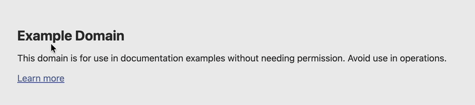
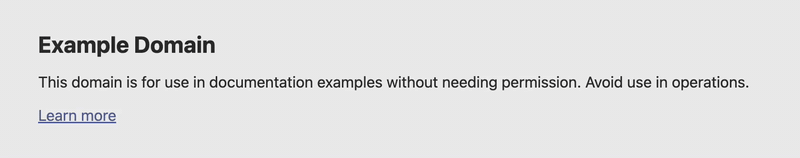

<div align="center">
  
  <h1>Selo</h1>
  <p><a href="README.md">English</a> · <a href="README.zh.md">中文</a> · 한국어 · <a href="README.ja.md">日本語</a></p>
</div>

- **선택 즉시 번역**: 어떤 앱에서든 텍스트를 선택하고 단축키를 누르면 번역
- **스크린샷 번역**: 화면 영역을 선택 → OCR → OCR 좌표에 맞춰 원문 위에 번역문을 덮어씀
- **플러그인 엔진**: 키가 필요 없는 서비스 여러 개 내장, ES module로 원하는 번역 API 연결 가능
- **로컬 우선**: 키는 시스템 키체인에 저장, 평문으로 디스크에 남기지 않음
- **가벼움**: 단일 파일 약 7 MB, 런타임 불필요; 네이티브 UI, 빠른 시작, 낮은 메모리 사용

<br>

| 선택 즉시 번역 | 스크린샷 번역 |
|---|---|
|  |  |

<br>

## 설치

플랫폼에 맞는 패키지를 [Releases](https://github.com/osdodo/selo/releases)에서 내려받으세요.

**Linux**

```bash
sudo apt install ./selo_<ver>_amd64.deb      # Debian / Ubuntu
sudo dnf install ./selo-<ver>-1.x86_64.rpm   # Fedora / RHEL
```

**macOS**

1. dmg를 열고 **Selo.app**을 응용 프로그램으로 드래그합니다.
2. dmg는 공증되지 않았습니다. 첫 실행 시 "손상됨"이 뜨면 한 번 실행하세요:

   ```bash
   xattr -dr com.apple.quarantine /Applications/Selo.app
   ```

3. 첫 실행 시 「시스템 설정 → 개인정보 보호 및 보안」에서 Selo에 두 가지 권한을 허용한 뒤 Selo를 재시작하세요:
   - **손쉬운 사용**: 선택한 텍스트 읽기
   - **화면 기록**: 스크린샷 OCR

   허용 후에도 계속 팝업되면 앱이 `/Applications`에 있는지 확인하고(dmg에서 직접 실행하지 마세요) 앱을 재시작하세요.

## 사용

| 단축키 | 동작 |
|---|---|
| `⌥D` · `Ctrl+Alt+D` | 선택한 텍스트 번역 |
| `⌥S` · `Ctrl+Alt+S` | 화면 영역 선택 → OCR → 번역 (드래그로 선택, 우클릭 또는 클릭으로 취소) |

트레이 메뉴 → 「설정…」에서 번역 서비스, 대상 언어, 단축키, UI 언어를 바꿀 수 있습니다.

## TODO

- [ ] **다중 모니터**: 커서가 있는 화면에 창 열기; 화면별 좌표 변환은 하드웨어 검증 필요
- [ ] **로컬 OCR**: CLI 전용 로컬 OCR(tesseract / PaddleOCR)은 플러그인 `kind: "command"` 서브프로세스 지원 필요
- [ ] **스트리밍**: 번역 결과 스트리밍(첫 스트리밍 엔진 도입 시)

## 플러그인

엔진은 플러그인 경로만 사용하며, 설정이 없거나 빌드에 실패하면 기본 서비스로 폴백합니다. 요청은 시스템 프록시를 따릅니다.

내장(기본적으로 deepl / google / bing / ocrspace 표시, 나머지는 「내장 플러그인 추가」에서):

| id | 종류 | 비고 |
|---|---|---|
| `deepl` | 번역 | 키 불필요 `free` / 공식 `api` |
| `google` | 번역 | 키 불필요 웹 엔드포인트 / Cloud Translation `api` |
| `bing` | 번역 | 키 불필요 Microsoft Edge 엔드포인트 |
| `deepseek` | 번역 | OpenAI 호환, 키 필요 |
| `youdao` | 번역 | 공식 API, appkey / secret 필요 |
| `local` | 번역 | OpenAI 호환(Ollama / LM Studio / llama.cpp / vLLM), `127.0.0.1` 전용 |
| `ocrspace` | OCR | 클라우드 OCR |

커스텀 플러그인은 단일 ES module로, 사용자 데이터 디렉터리의 `plugins/`에 넣거나(같은 id는 내장을 덮어씀) 「설정… → 플러그인 설정 → 외부 플러그인 추가」로 가져옵니다:

```js
export const meta = {
    id: "my-engine", name: "My Engine", version: "1.0.0",
    kind: "translate",              // 또는 "ocr"
    timeout_ms: 15000,
    allow_hosts: ["api.example.com"],
    config: [{ key: "api_key", label: "API Key", type: "secret", required: true }],
};

export async function translate(text, from, to) {
    const res = await fetch("https://api.example.com/translate", {
        method: "POST",
        headers: { Authorization: `Bearer ${config.api_key}` },
        body: JSON.stringify({ text, from, to }),
    });
    if (!res.ok) throw new Error(`HTTP ${res.status}`);
    return JSON.parse(res.text).translation;
}
```

OCR 플러그인은 `ocr(pngBase64)`를 내보내고 이미지의 물리 픽셀, 좌상단 원점 기준 `[{ x, y, width, height, text, confidence }]`를 반환합니다.

`meta` 필드:

| 필드 | 설명 |
|---|---|
| `kind` | `translate`(기본) 또는 `ocr` |
| `timeout_ms` | 네트워크 및 JS 타임아웃, 기본 `30000` |
| `allow_hosts` | 접근 가능한 도메인 화이트리스트 |
| `no_proxy` | `true`면 시스템 프록시를 우회해 직접 연결 |
| `config[]` | 설정 필드: `string` / `secret`, `required`, `default`, `options`(드롭다운), `show_if`(조건부) |

플러그인은 호출마다 새 QuickJS 샌드박스에서 실행되며 호스트 `fetch`만 사용할 수 있습니다.

데이터 디렉터리(`config.toml`과 `plugins/`가 있으며 키는 시스템 키체인에 저장):

| 플랫폼 | 디렉터리 |
|---|---|
| macOS | `~/Library/Application Support/Selo/` |
| Windows | `%APPDATA%\Selo\` |
| Linux | `$XDG_DATA_HOME/Selo/` |

## 라이선스

Licensed under [GPL-3.0-or-later](https://www.gnu.org/licenses/gpl-3.0.html).
